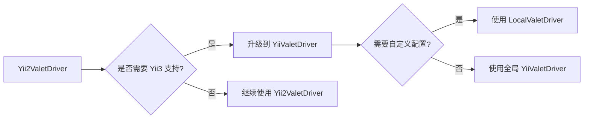

# YiiValetDriver Technical Analysis

## 概述

本文档详细分析了 `YiiValetDriver` 的设计，解释了如何同时支持 Yii2 和 Yii3 的目录结构，同时保持向后兼容性。

## 目录结构对比

### Yii2 标准结构
```
yii2-app-basic/
├── yii                  # 控制台启动文件
├── web/                 # Web 根目录
│   ├── index.php        # 主入口
│   └── assets/
├── config/
├── controllers/
├── runtime/
└── vendor/
    └── yiisoft/
        └── yii2/
            └── Yii.php  # Yii2 核心类
```

### Yii3 标准结构
```
yii3-app/
├── bin/                 # 二进制文件目录
│   └── yii              # 控制台启动文件
├── public/              # Web 根目录
│   ├── index.php        # 主入口
│   └── assets/
├── config/
│   └── web.php          # Web 配置
├── runtime/
└── vendor/
    └── yiisoft/
        └── yii/         # Yii3 包（注意：没有数字后缀）
            └── ...
```

## 核心改进设计

### 1. 自动检测机制

```php
public function serves(string $sitePath, string $siteName, string $uri): bool
{
    // 优先检测 Yii3
    if ($this->isYii3Project($sitePath)) {
        return true;
    }

    // 次之检测 Yii2
    if ($this->isYii2Project($sitePath)) {
        return true;
    }

    // 降级检测：任何包含 index.php 的 web 目录
    foreach (self::WEB_DIRECTORIES as $webDir) {
        if (file_exists($sitePath . '/' . $webDir . '/index.php')) {
            return true;
        }
    }

    return false;
}
```

### 2. Web 目录优先级

```php
private const WEB_DIRECTORIES = [
    'public',  // 优先：Yii3 / 现代结构
    'web',     // 兼容：Yii2
];
```

**设计理由：**
- 如果同时存在 `public/` 和 `web/`，优先使用 `public/`（更可能是 Yii3 项目）
- 保持向后兼容，Yii2 项目可以继续使用 `web/`

### 3. 框架版本检测

#### Yii3 检测逻辑
```php
private function isYii3Project(string $sitePath): bool
{
    // 1. 检查 Yii3 特有的控制台文件位置
    if (file_exists($sitePath . '/bin/yii')) {
        return true;
    }

    // 2. 检查 Yii3 的 vendor 包名
    if (file_exists($sitePath . '/vendor/yiisoft/yii') ||
        file_exists($sitePath . '/../vendor/yiisoft/yii')) {
        return true;
    }

    // 3. 检查 Yii3 典型的配置文件结构
    if (file_exists($sitePath . '/config/web.php') &&
        file_exists($sitePath . '/public/index.php')) {
        return true;
    }

    return false;
}
```

#### Yii2 检测逻辑
```php
private function isYii2Project(string $sitePath): bool
{
    // 1. 检查 Yii2 特有的控制台文件位置（根目录）
    if (file_exists($sitePath . '/yii')) {
        return true;
    }

    // 2. 检查 Yii2 的 vendor 包名
    if (file_exists($sitePath . '/vendor/yiisoft/yii2/Yii.php') ||
        file_exists($sitePath . '/../vendor/yiisoft/yii2/Yii.php')) {
        return true;
    }

    return false;
}
```

### 4. 动态 Web 目录解析

```php
private function getWebDirectory(string $sitePath): ?string
{
    foreach (self::WEB_DIRECTORIES as $webDir) {
        if (file_exists($sitePath . '/' . $webDir . '/index.php')) {
            return $webDir;
        }
    }

    return null;
}
```

这个方法在整个驱动中被调用，确保：
- `isStaticFile()` 从正确的目录查找静态文件
- `frontControllerPath()` 从正确的目录加载入口文件

### 5. 扩展的入口点支持

原版 `Yii2ValetDriver`:
```php
$entries = ['api', 'backend'];
```

新版本 `YiiValetDriver`:
```php
$entries = ['api', 'backend', 'admin', 'oauth2', 'v1', 'v2'];
```

支持更多的常见入口点模式，适用于微服务、API 版本控制等场景。

## 兼容性保证

### 向后兼容性矩阵

| 场景 | Yii2ValetDriver | YiiValetDriver | 兼容性 |
|------|----------------|----------------|--------|
| 标准 Yii2 basic 项目 | ✅ | ✅ | ✅ 完全兼容 |
| 标准 Yii2 advanced 项目 | ✅ | ✅ | ✅ 完全兼容 |
| Yii2 自定义入口点 | ✅ | ✅ | ✅ 完全兼容 |
| Asset 子域名 | ✅ | ✅ | ✅ 完全兼容 |
| 标准 Yii3 项目 | ❌ | ✅ | ✅ 新功能 |
| Yii3 多入口点 | ❌ | ✅ | ✅ 新功能 |
| 混合项目（同时有 web/ 和 public/） | 可能冲突 | 优先 public/ | ✅ 预期行为 |

### 迁移路径



## 关键差异点

### 1. 命名空间
- **原版**: `namespace Valet\Drivers\Custom;`
- **新版**: 保持不变，避免破坏现有配置

### 2. 检测逻辑
```php
// 原版：只检查 Yii2
if (file_exists($sitePath . '/yii')) {
    return true;
}
if (file_exists($sitePath . '/../vendor/yiisoft/yii2/Yii.php') ||
    file_exists($sitePath . '/vendor/yiisoft/yii2/Yii.php')) {
    return true;
}

// 新版：同时检查 Yii2 和 Yii3
if ($this->isYii3Project($sitePath)) {
    return true;
}
if ($this->isYii2Project($sitePath)) {
    return true;
}
```

### 3. Web 目录处理
```php
// 原版：硬编码 web/
$staticFilePath = $sitePath . '/web/' . $uri;

// 新版：动态检测 web/
$webDir = $this->getWebDirectory($sitePath);
$staticFilePath = $sitePath . '/' . $webDir . '/' . $uri;
```

## 性能考虑

### 文件系统调用优化

虽然增加了多个文件存在性检查，但影响有限：

1. **短路求值**: 一旦检测到匹配条件，立即返回
2. **优先级排序**: 先检查最可能的场景
3. **缓存友好**: PHP 的文件状态缓存会减少实际 I/O

### 检测顺序优化

```
1. Yii3 bin/yii 文件        (最快，Yii3 项目常见)
2. Yii3 yiisoft/yii 包     (快速，Yii3 标准结构)
3. Yii3 config/web.php     (中等，需要检查两个文件)
4. Yii2 yii 文件           (快速，Yii2 项目常见)
5. Yii2 yiisoft/yii2 包   (快速，Yii2 标准结构)
6. 降级检查 web/index.php  (兜底方案)
```

## 边界情况处理

### 情况 1：同时有 web/ 和 public/

```php
// YiiValetDriver 会优先选择 public/
foreach (self::WEB_DIRECTORIES as $webDir) {
    if (file_exists($sitePath . '/' . $webDir . '/index.php')) {
        return $webDir; // 返回第一个匹配的，即 'public'
    }
}
```

**建议**: 这种情况下，项目应该只保留一个 web 目录。

### 情况 2：既不是 Yii2 也不是 Yii3

如果 `serves()` 返回 `false`，Valet 会继续尝试其他驱动，最终使用默认驱动。

### 情况 3：自定义项目结构

对于非标准项目，建议使用 `LocalValetDriver.php` 并自定义配置。

## 总结

`YiiValetDriver` 通过以下设计实现了兼容性和扩展性的平衡：

1. ✅ **向后兼容**: 所有 Yii2 项目无需修改即可继续使用
2. ✅ **自动检测**: 智能识别 Yii2 和 Yii3 项目
3. ✅ **灵活配置**: 通过 `LocalValetDriver` 支持自定义需求
4. ✅ **最小侵入**: 修改集中在检测逻辑，不影响路由核心
5. ✅ **优雅降级**: 当无法识别框架时仍能作为通用 PHP 驱动工作

这个设计使得用户可以无缝地从 Yii2ValetDriver 迁移到 YiiValetDriver，同时获得 Yii3 的支持能力。
